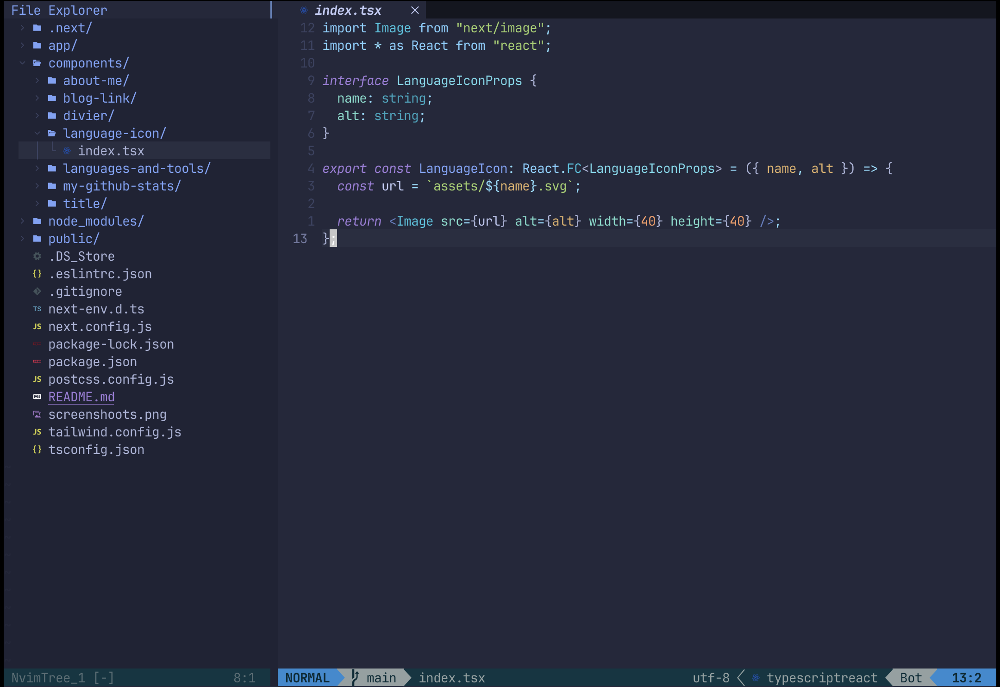

# daming nvim config

## preview



## requirements

- Neovim >= 0.9.0 (needs to be built with LuaJIT)
- Git >= 2.19.0 (for partial clones support)
- a [Nerd Font](https://www.nerdfonts.com/) (v3.0 or greater) (optional, but to display somes icons)
- [lazygit](https://github.com/jesseduffield/lazygit) (optional)
- a C ompiler for _nvim-treesitter_. See [here](https://github.com/nvim-treesitter/nvim-treesitter#requirements)
- for [telescope.nvim](https://github.com/nvim-telescope/telescope.nvim) (optional)
  - live grep: [ripgrep](https://github.com/BurntSushi/ripgrep)
  - find files: [fd](https://github.com/sharkdp/fd)

## install

for windows user

```bash
winget install Neovim.Neovim

choco install neovim

scoop bucket add main
scoop install neovim
```

for macos user

```bash
brew install neovim
```

linux

```bash
curl -LO https://github.com/neovim/neovim/releases/latest/download/nvim.appimage
chmod u+x nvim.appimage
./nvim.appimage
```

> for china user, use `https://mirror.ghproxy.com/https://github.com/neovim/neovim/releases/latest/download/nvim.appimage` to imporve network seed.

## setup

instal nerod font

```shell
brew tap homebrew/cask-fonts && brew install --cask font-jetbrains-mono-nerd-font
```

install ripgrep which is a fast search tool

```shell
# for macos
brew install ripgrep

# for widnwos
choco install ripgrep
# nvim-treesitter need c compiler
choco install mingw
```

install fd

```shell
# macos
brew install fd

# windows
scoop install fd
choco install fd
winget install sharkdp.fd

# Ubuntu
sudo apt install fd-find && ln -s $(which fdfind) ~/.local/bin/fd
```

install lazygit (optional)

```bash
# macos
brew install jesseduffield/lazygit/lazygit
brew install lazygit


# windows
# Add the extras bucket
scoop bucket add extras
# Install lazygit
scoop install lazygit

# ubuntu
LAZYGIT_VERSION=$(curl -s "https://api.github.com/repos/jesseduffield/lazygit/releases/latest" | grep -Po '"tag_name": "v\K[^"]*')
curl -Lo lazygit.tar.gz "https://github.com/jesseduffield/lazygit/releases/latest/download/lazygit_${LAZYGIT_VERSION}_Linux_x86_64.tar.gz"
tar xf lazygit.tar.gz lazygit
sudo install lazygit /usr/local/bin
```

### language server

```bash
brew install lua-language-server
```

## refrence

0. [简明 VIM 练级攻略](https://coolshell.cn/articles/5426.html)
   > > [github page](http://xstarcd.github.io/wiki/vim/vim_simple.html)
1. [nvim 打造一个适合自己的开发环境](https://learnku.com/articles/68258?order_by=vote_count&)
2. [Set up Neovim on a new M2 MacBook Air for coding React, TypeScript, Tailwind CSS, etc](https://www.youtube.com/watch?v=ajmK0ZNcM4Q)-->[text version:My Neovim setup for React, TypeScript, Tailwind CSS, etc](https://dev.to/craftzdog/my-neovim-setup-for-react-typescript-tailwind-css-etc-58fb)
3. [学习 Neovim 全 lua 配置](https://zhuanlan.zhihu.com/p/571617696)
4. [干掉 vim 的神奇 neovim 替代 IDE, 来教你快速上手配置，保姆教程](https://learnku.com/articles/75829)
5. [How to Set up Neovim for Windows and Linux with Lua and Packer](https://dev.to/slydragonn/how-to-set-up-neovim-for-windows-and-linux-with-lua-and-packer-2391)
6. [InsisVim](https://github.com/nshen/InsisVim)
7. [astronvim_with_coc_or_mason](https://github.com/chaozwn/astronvim_with_coc_or_mason)
